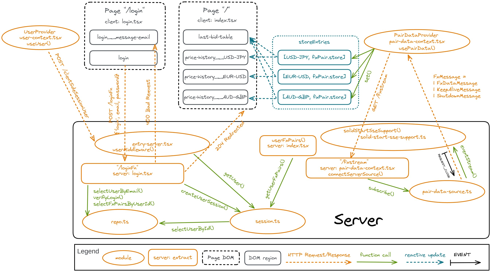

# SolidStart SSE Push 

TL;DR: Wanting to understand [server-sent events (sse)](https://developer.mozilla.org/en-US/docs/Web/API/Server-sent_events) in more detail; chose to scan though [Data Push Applications Using HTML5 SSE](https://play.google.com/store/books/details/Darren_Cook_Data_Push_Apps_with_HTML5_SSE?id=7gYiAwAAQBAJ) (2014) ([repo](https://github.com/DarrenCook/ssebook)) and then reinforce learning by implementing many of the concepts in a [SolidStart](https://start.solidjs.com/) demo.

## Background

The remix-run examples feature an [sse-counter](https://github.com/remix-run/examples/tree/main/sse-counter) which uses remix-utils' [`useEventSource`](https://github.com/sergiodxa/remix-utils/blob/main/src/react/use-event-source.tsx) hook to access server-sent events. Unfortunately each invocation of of `useEventSource` creates it's **own** instance of [`EventSource`](https://developer.mozilla.org/en-US/docs/Web/API/EventSource).

That approach may work over HTTP/2 and later but browser's enforce a browser-wide 6 connection per domain limit for HTTP/1.1 and each `EventSource` instance ties up a single connection for the domain (over the whole browser, not just the page). Because of this limitation the [HTML Living Standard](https://html.spec.whatwg.org/multipage/server-sent-events.html#authoring-notes) recommends:

> Clients that support HTTP's per-server connection limitation might run into trouble **when opening multiple pages from a site if each page has an `EventSource` to the same domain**. Authors can avoid this using the relatively complex mechanism of using unique domain names per connection, or by allowing the user to enable or disable the `EventSource` functionality on a per-page basis, or by sharing a single `EventSource` object using a [shared worker](https://html.spec.whatwg.org/multipage/workers.html#sharedworkerglobalscope). 

… i.e. one **single** `EventSource` instance should be serving the entire web application as some sort of server-client event bus. It's likely a mistake to create that `EventSource` inside an ordinary component. It more likely should be managed centrally by a provider that makes it possible for components to subscribe to relevant events.  

Websockets are frequently suggested as a better alternative as they support bi-directional communication but Websockets are a protocol ([RFC 6455](https://datatracker.ietf.org/doc/html/rfc6455)) separate from [HTTP](https://datatracker.ietf.org/doc/html/rfc8441) which needs to be brought forward separately after each HTTP revision ([RFC 8441](https://datatracker.ietf.org/doc/html/rfc8441)).

There are scenarios where server-sent events can be more effective:
* [Using Server-Sent Events to Simplify Real-time Streaming at Scale](https://shopify.engineering/server-sent-events-data-streaming)
* [SSE vs WebSockets vs Long Polling. Martin Chaov. JS Fest 2018](https://youtu.be/n9mRjkQg3VE)

(Though in some instances [Fat Events](https://youtu.be/jdliXz70NtM?t=716) can become a problem)

This demonstration application outlines the solution approach envisioned by porting various aspects of the PHP sample application *FX Client* (Foreign eXchange) of [Data Push Applications Using HTML5 SSE](https://github.com/DarrenCook/ssebook) to [SolidStart](https://start.solidjs.com/getting-started/what-is-solidstart).

## Discussion



### Client Page (Component)

Collaborators:
- [`src/components/pair-data-context.tsx`](#pair-data-context) (via `usePairData()`)

Here the client route (page) isn't even aware that an event source is being used as the page consumes a context provided store, obtained with `usePairData()`, that exposes the data that is aggregated from the realtime events.

```TypeScript
// file: src/routes/index.tsx
// …

// --- START server side ---
import {
  createServerData$,
  type ServerFunctionEvent,
} from 'solid-start/server';

import { getUserPairs } from '~/server/session';

function userFxPairs(this: ServerFunctionEvent) {
  return getUserPairs(this.request);
}

// --- END server side ---

export function routeData() {
  return createServerData$(userFxPairs);
}
```

The `routeData()` simply provides the page with the *foreign exchange pairs* (e.g. `USD/JPY`, `EUR/USD`, `AUD/GBP`) which the page (based on the logged-in user) will have access to.

```TypeScript
// file: src/routes/index.tsx
// …

const latestBid = (store: PairStore) =>
  store.prices.length > 1 ? store.prices[0].bid : '';

export default function Home() {
  const userPairs = useRouteData<typeof routeData>();
  const fxPairRecord = usePairData();
  const entries = createMemo(() => userPairs()?.map(fxPairRecord));
  onCleanup(disposePairData);

  return (
    /* lots of JSX */
  );
}
```

`fxPairRecord()` is simply a function that returns the appropriate "record" for the passed foreign exchange pair symbol. The record (an ES object) holds the `symbol` for the `fxPair`, its `label` and the reactive [`store`](https://www.solidjs.com/docs/latest/api#createstore) accessor that contains the most recent historical prices for that `fxPair`. 

```TypeScript
type PriceJson = {
  timestamp: number;
  bid: string;
  ask: string;
};

type Pair = {
  symbol: string;
  prices: Array<{
    timestamp: Date;
    bid: string;
    ask: string;
  }>;
};

type FxPairEntry = {
  fxPair: {
    symbol: string;
    label: string;
    store: Store<Pair>;
  };
  set: (latest: PriceJson[]) => void;
};

type FxPairRecordFn = (symbol: string) => fxPairEntry['fxPair'];
```

So `entries` holds all the `fxPair` records the user has access to.

`disposePairData` is simply used to decrement the reference count on the central event source ([`onCleanup`](https://www.solidjs.com/docs/latest/api#oncleanup)) so it can disconnect when there are no more "subscribers".

```TSX
<div class="last-bid-table">
  <table>
    <thead>
      <tr>
        <For each={entries()}>
          {({ label }) => <th scope="col">{label}</th>}
        </For>
      </tr>
    </thead>
    <tbody>
      <tr>
        <For each={entries()}>
          {({ store, symbol }) => <td id={symbol}>{latestBid(store)}</td>}
        </For>
      </tr>
    </tbody>
  </table>
</div>
```
This creates a single table with a single column for each `fxPair` showing only the most recent bid. The row entries are reactive as they access the contents of the reactive store via the `latestBid()` function under the reactive root of the JSX.

```TSX
<For each={entries()}>
  {({ store, symbol, label }) => (
    <div class="price-table">
      <table>
        <caption>{label}</caption>
        <thead>
          <tr>
            <th>Timestamp</th>
            <th>Bid</th>
            <th>Ask</th>
          </tr>
        </thead>
        <tbody id={`price-history__${symbol}`}>
          <For each={store.prices}>
            {(price) => (
              <tr>
                <td>{formatTimestamp(price.timestamp)}</td>
                <td>{price.bid}</td>
                <td>{price.ask}</td>
              </tr>
            )}
          </For>
        </tbody>
      </table>
    </div>
  )}
</For>
```
This creates a single table for each `fxPair` to display a history of the most recent prices. The store maintains the referential stability of the existing `prices` records making it possible for SolidJS to reuse the DOM fragments as new price records are added to the store.

```TSX
// file: src/routes/index.tsx
// …

<>
  <Title>FX Client: latest prices</Title>
  <main class="prices-wrapper">
    { /* last bid table */ }
    { /* history table per fxPair */ }
    <footer class="info">
      <p>
        Visit{' '}
        <a href="https://start.solidjs.com" target="_blank">
          start.solidjs.com
        </a>{' '}
        to learn how to build SolidStart apps.
      </p>
      <div>
        <form method="post" action="/logout">
          <button type="submit">Logout</button>
        </form>
      </div>
    </footer>
  </main>
</>
```

The footer contains the logout action which redirects to the login page.


### Pair Data Context

Collaborators:
- `src/server/pair-data-source.ts`
- `usePairData()` [clients](#client-page-component)

The `PairProvider` passes the `fxPairRecord` function via `usePairData()` to context clients which in turn can use `fxPairRecord()` to obtain the `{ symbol, label, store }` record for the specified `symbol`. `store` is the [Store](https://www.solidjs.com/docs/latest/api#stores) accessor to a reactively updating `{ symbol, prices[]}` record.

```TypeScript
// file: src/components/pair-data-context.tsx

// …

function fxPairRecord(symbol: string) {
  const entry = getStoreEntry(symbol);

  return entry.fxPair;
}

const PairDataContext = createContext(fxPairRecord);

// …

// --- Context management ---
function PairDataProvider(props: ParentProps) {
  setupEventData();

  return (
    <PairDataContext.Provider value={fxPairRecord}>
      {props.children}
    </PairDataContext.Provider>
  );
}

function usePairData() {
  setRefCount(increment);
  return useContext(PairDataContext);
}

export { disposePairData, PairDataProvider, usePairData };
```
`usePairData()` also increments a reference count which the context uses to determine whether a connection to the server's event source is currently needed.

```TypeScript
// file: src/components/pair-data-context.tsx

// --- Context consumer reference count (connect/disconnect) ---
const [refCount, setRefCount] = createSignal(0);
const increment = (n: number) => n + 1;
const decrement = (n: number) => (n > 0 ? n - 1 : 0);

const disposePairData = () => setRefCount(decrement);

// …
```

The reference count is a signal that keeps track of the currently active `usePairData()` invocations which are expected to be decremented by using `disposePairData()` via [`onCleanup`](https://www.solidjs.com/docs/latest/api#oncleanup).

```TypeScript
// file: src/components/pair-data-context.tsx

let startTimeout: ReturnType<typeof setTimeout> | undefined;
let start: () => void | undefined;

// …

function setupEventData() {
  const fxstream = server$(connectServerSource);
  start = () => {
    disconnect();
    startTimeout = undefined;
    connect(fxstream.url);
  };

  createEffect(() => {
    const count = refCount();

    if (count < 1) {
      if (isActive()) {
        disconnect();

        lastEventId = undefined;

        if (startTimeout) {
          clearTimeout(startTimeout);
          startTimeout = undefined;
        }
      }

      return;
    }

    if (count > 0) {
      if (isActive()) return;

      start();
      return;
    }
  });
}

// …
```
`setupEventData()` initializes the context behaviour. It creates an RPC handle with [`server$()`](https://start.solidjs.com/api/server) and sets up the module global `start()` function with it. The [`createEffect()`](https://www.solidjs.com/docs/latest/api#createeffect) is triggered whenever the `refCount` signal changes. Based on the most recent count the event source is disconnected or started as needed.

Note that RPC handle is only used to obtain the URL of the endpoint and otherwise not as an RPC function.


```TypeScript
const isActive = () =>
  Boolean(eventSource || startTimeout || abort || sampleTimeout);
```
The context is considered active when:
- an `eventSource` currently exists OR
- an `eventSource` is scheduled to start OR
- there is an active `AbortController` OR
- an eventSample is scheduled to start

```TypeScript
//  0 - No connection attempted
//  1 - EventSource created
//  2 - At least one message received via event source
//  3 - Use longpoll fallback (event source had error before reaching 2)
// -1 - Connection failed (fallback also encountered an error; perhaps
//      identifying the reason for the event source failure)
//
const BIND_IDLE = 0;
const BIND_WAITING = 1;
const BIND_MESSAGE = 2;
const BIND_LONG_POLL = 3;
const BIND_FAILED = -1;
let sourceBind = BIND_IDLE;
```

`sourceBind` tracks the connection progress. Based on its value the `connect()` function determines whether to attempt to receive an event stream over [server-sent events](https://developer.mozilla.org/en-US/docs/Web/API/Server-sent_events/Using_server-sent_events) or to perform event sampling via [long polling](https://javascript.info/long-polling#long-polling).

```TypeScript
function connect(path: string) {
  if (sourceBind !== BIND_LONG_POLL) connectEventSource(path);
  else connectLongPoll(path);
}
```

#### Event Streaming with `EventSource`

```TypeScript
// …

let eventSource: EventSource | undefined;

// …

function connectEventSource(path: string) {
  const href = toHref(path, lastEventId);

  eventSource = new EventSource(href);
  sourceBind = BIND_WAITING;
  eventSource.addEventListener('error', onError);
  eventSource.addEventListener('message', onMessage);
  setKeepAlive();
}
```

`connectEventSource()` simply creates an [`EventSource`](https://developer.mozilla.org/en-US/docs/Web/API/EventSource) for the specified endpoint and attaches [`message`](https://developer.mozilla.org/en-US/docs/Web/API/EventSource/message_event) and [`error`](https://developer.mozilla.org/en-US/docs/Web/API/EventSource/error_event) event handlers. Finally it starts up the keep alive timing.

An `EventSource` will automatically reconnect when it loses the connection with the server but does not deal with unexpected inactivity.

The keep alive timer expires when there has been an extended period without any server-sent events. The connection is then forcefully closed and reconnected. Note that the `lastEventId` is passed after a forced close.

```TypeScript
const KEEP_ALIVE_MS = 20000;

// --- Keep alive timer ---
let keepAliveTimeout: ReturnType<typeof setTimeout> | undefined;
let start: () => void | undefined;

// …

function clearKeepAlive() {
  if (!keepAliveTimeout) return;

  clearTimeout(keepAliveTimeout);
  keepAliveTimeout = undefined;
}

function setKeepAlive() {
  clearKeepAlive();
  keepAliveTimeout = setTimeout(start, KEEP_ALIVE_MS);
}
```

The `start` function was set in `setupEventData()`. `start()` runs 20 seconds (`KEEP_ALIVE_MS`) after the last event. Whenever an event is received `setKeepAlive()` is called to cancel the current timer and start a new one. At the same time the `lastEventId` is captured so that it is available in case a forced reconnect becomes necessary.

```TypeScript
// …

let lastEventId: string | undefined;

// …

function onMessage(event: MessageEvent<string>) {
  if (event.lastEventId) lastEventId = event.lastEventId;
  setKeepAlive();

  const message = fromJson(event.data);
  if (!message) return;

  sourceBind = BIND_MESSAGE;
  update(message);
}
```

Note that while *in general* [`message.data`](https://developer.mozilla.org/en-US/docs/Web/API/MessageEvent/data) could be any type, in the context of an `EventSource` it will always be a `string` (e.g. in cases like [`MessagePort`](https://developer.mozilla.org/en-US/docs/Web/API/MessageEvent/data) it could be any [structurally clonable](https://developer.mozilla.org/en-US/docs/Web/API/MessageEvent/data) value).

`fromJson()` returns an `FxMessage` (a [discriminated union](https://www.typescriptlang.org/docs/handbook/2/narrowing.html#discriminated-unions)) which is then processed by `update()`.

```TypeScript
// file: src/lib/foreign-exchange.ts

// …

export type FxDataMessage = {
  kind: 'fx-data',
  symbol: string, // Exchange Pair
  timestamp: number,
  prices: PriceJson[],
};

export type KeepAliveMessage = {
  kind: 'keep-alive',
  timestamp: number,
};

export type ShutdownMessage = {
  kind: 'shutdown',
  timestamp: number,
  until: number,
};

export type FxMessage = FxDataMessage | KeepAliveMessage | ShutdownMessage;
```

`update()` delegates the processing of the `FxDataMessage` content to `pushPrices()`. 

The `KeepAliveMessage` serves two puposes; (1) it resets the client's `keepAliveTimeout`; (2) it tries to prevent any intermdiate proxies from closing the connection due to inactivity.

The `ShutdownMessage` advises the client of a data source shutdown and when service will be resumed (`preconnectMs()` is just a random interval to be deducted to connect to the source before the service resumes but while it is already accepting new connections).

```TypeScript
// file: src/components/pair-data-context.tsx

// …

function update(message: FxMessage) {
  switch (message.kind) {
    case 'fx-data': {
      // De-multiplex messages by pushing
      // prices onto the matching exchange pair store
      const { symbol, prices } = message;
      pushPrices(symbol, prices);
      return;
    }

    case 'keep-alive':
      console.log('keep-alive');
      return;

    case 'shutdown': {
      disconnect();
      const delay = message.until - message.timestamp - preconnectMs();
      console.log(`shutdown ${message.timestamp} ${message.until} ${delay}`);
      startTimeout = setTimeout(
        start,
        delay > MIN_WAIT_MS ? delay : MIN_WAIT_MS
      );
      return;
    }
  }
}
```
The error handler is used to detect if the `EventSource` connection fails. When the connection has failed, it's `readyState` is [closed](https://developer.mozilla.org/en-US/docs/Web/API/EventSource/readyState#value). If at this point no message event has been received over the `EventSource` a long-polling connection is attempted.

```TypeScript
const READY_STATE_CLOSED = 2;

// …

function onError(_event: Event) {
  // No way to identify the reason here so try long polling next
  if (
    eventSource?.readyState === READY_STATE_CLOSED &&
    sourceBind !== BIND_MESSAGE
  ) {
    sourceBind = BIND_LONG_POLL;
    disconnectEventSource();
    setTimeout(start);
  }
}
```
When an `EventSource` is disconnected the keep aliver timer is stopped, the event handlers removed and the `EventSource` is closed and its reference purged.

```TypeScript
function disconnectEventSource() {
  if (!eventSource) return;

  clearKeepAlive();
  eventSource.removeEventListener('message', onMessage);
  eventSource.removeEventListener('error', onError);
  eventSource.close();
  eventSource = undefined;
}
```
#### Event Sampling with Long Polling

[Long Polling](https://javascript.info/long-polling) is used as an alternative to event streaming. In this demo the server delays responding to a regular fetch for 5 seconds or until 8 messages have been collected. As a result the client updates aren't as “realtime” as the SSE, event streamed version but can be just as complete.  

```TypeScript
// file: src/components/pair-data-context.tsx

// …

// --- Long poll fallback ---

const LONG_POLL_WAIT_MS = 50; // 50 milliseconds
let sampleTimeout: ReturnType<typeof setTimeout> | undefined;
let abort: AbortController | undefined;

// …

function connectLongPoll(path: string) {
  sampleTimeout = setTimeout(fetchSample, LONG_POLL_WAIT_MS, path);
}
```

The `connectLongPoll()` function initiates the cycle of `fetchSample` tasks. Note how the optional additional parameters on [`setTimeout`](https://developer.mozilla.org/en-US/docs/Web/API/setTimeout#languages-switcher-button) are used to pass the `path` of the endpoint to the scheduled fetch. 

```TypeScript
// file: src/components/pair-data-context.tsx

function multiUpdate(messages: FxMessage[]) {
  const lastIndex = messages.length - 1;
  if (lastIndex < 0) return;

  for (const message of messages) update(message);

  lastEventId = String(messages[lastIndex].timestamp);
}

function sampleFailed() {
  sourceBind = BIND_FAILED;
  disconnectLongPoll();
}

async function fetchSample(path: string) {
  sampleTimeout = undefined;
  console.assert(abort === undefined, 'sample abort unexpectedly set');

  let waitMs = -1;
  try {
    const href = toHref(path, lastEventId, false);
    abort = new AbortController();

    setKeepAlive();
    const response = await fetch(href, { signal: abort.signal });
    clearKeepAlive();

    if (response.ok) {
      const messages = await response.json();

      if (isFxMessageArray(messages)) multiUpdate(messages);
      waitMs = LONG_POLL_WAIT_MS;
    } else {
      sampleFailed();
    }
  } catch (error) {
    console.error('fetchSample', error);
    sampleFailed();
  } finally {
    if (waitMs >= 0) {
      const current = abort;
      abort = undefined;

      sampleTimeout =
        typeof current === 'undefined'
          ? undefined
          : setTimeout(fetchSample, waitMs, path);
    }
  }
}
```

`fetchSample` starts by creating an [`AbortController`](https://developer.mozilla.org/en-US/docs/Web/API/AbortController) and starting the keep alive timer in case the response takes too long. Each message in the `FxMessage[]` response is pushed by `multiUpdate()` through the `update()` function. Note that the URL (`href`) specifies the `lastEventId` received by the client so that the server does send any duplicate messages or miss any messages (as long as they are still cached). 

If the polling cycle completed successfully another one is scheduled to fetch the next collection of messages.

```Typescript
function disconnectLongPoll() {
  clearKeepAlive();

  if (sampleTimeout) {
    clearTimeout(sampleTimeout);
    sampleTimeout = undefined;
  }

  if (abort) {
    abort.abort();
    abort = undefined; // i.e. don't repoll
  }
}
```

`disconnectLongPoll()` stops the polling cycle by cancelling the keep alive and sample timeout. The abort controller is activated if present to terminate the request that is currently polling.

#### Data Demultiplexing

The `update()` function processes the various `FxMessage` types separately. `pushPrices()` stores the `FxDataMessage` payloads according to their price `symbol`.

```TypeScript
// file: src/components/pair-data-context.tsx

// …

function pushPrices(symbol: string, latest: PriceJson[]) {
	const entry = getStoreEntry(symbol);

	entry.set(latest);
}
```

```TypeScript
// file: src/lib/foreign-exchange.ts

export type PriceJson = {
  timestamp: number; // milliseconds since ECMAScript epoch
  bid: string; // decimal
  ask: string; // decimal
};

export type Price = Omit<PriceJson, 'timestamp'> & {
  timestamp: Date;
};

// …

export type Pair = {
  symbol: string;
  prices: Price[];
};
```

``` TypeScript
// file: src/components/pair-data-context.tsx

// …

// --- Context data store management
export type PairStore = Store<Pair>;
```

An `FxMessage` delivers one or more `PriceJson` records that are associated with one specific `symbol`. By converting the `timestamp` from a `number` to a `Date` the `PriceJson` record becomes a `Price` record. The `Pair` type holds the identifying symbol and one or more timestamped `Price`s. 

A `PairStore` is a reactive [store](https://www.solidjs.com/docs/latest/api#using-stores) which holds one or more `Prices` for the identified `symbol`.


>Aside: composing a reusable function argument
>
>```TypeScript
>const data = [1, 2, 3, 4];
>
>// traditional single use (i.e. GC'ed) function argument
>const process1 = (addend: number) =>
>  data.reduce((acc, e) => acc + e + addend, 0);
>
>console.log(process1(-1)); // 6
>
>// Reusable alternative
>
>// Variable/mutable arguments holder
>const withAddend = {
>  addend: 0,
>};
>
>// Function portion which uses the arguments holder
>function reducerForAddend(this: typeof withAddend, acc: number, e: number) {
>  return acc + e + this.addend;
>}
>
>// Compose both to reusable function which doesn't need to be GC'd
>const reducer = reducerForAddend.bind(withAddend);
>
>const process2 = (addend: number) => (
>  (withAddend.addend = addend), data.reduce(reducer, 0)
>);
>
>console.log(process2(-1)); // 6
>```

The `WithLatestArgument` type outlines a mutable argument holder that contains a reference to the `latest` array from a `FxDataMessage` payload and a `maxLength` value specifying the maximum quantity of the most recent `Prices` to collect in the `Pair` managed by the reactive store.

```TypeScript
// file: src/components/pair-data-context.tsx

type WithLatestArguments = {
  latest: PriceJson[];
  maxLength: number;
};
```
The `withLastestPrices` function is composed with a `WithLatestArguments` instance. The `history` array passed to the function holds the most recent `Price` array inside a `Pair`. The function merges `history` and `this.lastest` into a new `Price` array with no more than `this.maxLength` elements.

```TypeScript
// file: src/components/pair-data-context.tsx

function withLatestPrices(this: WithLatestArguments, history: Price[]) {
	const { maxLength, latest } = this;
	const prices = [];

	// Transfer `latest` first to `prices`; most recent price first order.
	let i = 0;
	for (let j = 0; i < maxLength && j < latest.length; i += 1, j += 1)
		prices[i] = fromPriceJson(latest[j]);

	// Fill up `prices` with existing `history` prices up to `maxLength`
	for (let k = 0; i < maxLength && k < history.length; i += 1, k += 1)
		prices[i] = history[k];

	return prices;
}
```
- The containing `prices` array **has to change** to signal to the container store that it has been updated.
- But **retained prices need to be referentially stable**, i.e. existing `Price`s have to be kept, not cloned or recreated. Otherwise the DOM nodes depending on them will be unnecessarily deleted and recreated.
- `i` tracks the target index for the new `prices` array.
- `j` tracks the source index from `this.latest`
- `k` track the source index from `history`
- All `PriceJson` and `Price` instances are already orded by descending time value (most recent first) in their respective `latest` and `history` collections and the `prices` array is assembled **most recent `Price` first**. 

So `prices` is filled from `this.latest` first and then `history` until it either contains `this.maxLength` entries or the sources have been exhausted. 

```TypeScript
// file: src/components/pair-data-context.tsx

function makeStoreEntry(symbol: string) {
  const label = SYMBOLS.get(symbol) ?? '';
  const [pairPrices, setPairPrices] = createStore<Pair>({
    symbol,
    prices: [],
  });

  const presetArgs: WithLatestArguments = {
    latest: [],
    maxLength: 10,
  };
  // Prettier will remove the parenthesis resulting in:
  //   "An instantiation expression cannot be followed by a property access."
  // prettier-ignore
  const fn = withLatestPrices.bind(presetArgs);
  const set = (latest: PriceJson[]) => {
    presetArgs.latest = latest;
    setPairPrices('prices', fn);
  };

  return {
    fxPair: {
      symbol,
      label,
      store: pairPrices,
    },
    set,
  };
}

const storeEntries = new Map<string, ReturnType<typeof makeStoreEntry>>();
```
`makeStoreEntry` assembles the [`FxPairEntry`](#client-page-component). A store is created around an empty `Pair` instance and a `set` function capable of updating the `Price` array contained in the `Pair` from a `PriceJson` array assembled. The returned `FxPairEntry` holds the read-only `fxPair` and the `set` function to update the `Pair` `prices` ([Read/Write Segregation](https://www.solidjs.com/guides/getting-started#3-readwrite-segregation)).

`fxPair` holds the `symbol`, the display `label` for the `symbol` and the `Store<Pair>` accessor.

```TypeScript
// file: src/components/pair-data-context.tsx

// …

function getStoreEntry(symbol: string) {
  let entry = storeEntries.get(symbol);
  if (entry) return entry;

  entry = makeStoreEntry(symbol);
  storeEntries.set(entry.fxPair.symbol, entry);
  return entry;
}

function fxPairRecord(symbol: string) {
  const entry = getStoreEntry(symbol);

  return entry.fxPair;
}
```

`getStoreEntry` creates `FxPairEntry`s as needed, i.e. they are created whenever `pushPrices()` processes a `symbol` for the first time or when a context client needs access to a `symbol`'s `prices`. Once the entry and the store backing it exist, it is simply accessed as needed. `fxPairRecord` is the function which is shared by the context as the context value, giving any context client access to the read-only `fxPair`. `pushPrices()` on the other hand uses the `set` function of the `FxPairEntry` to update the contents of the `Prices` array.

#### Server (Integration) Endpoint

`connectServerSource` is the server side function that is wrapped in an RPC endpoint by [`server$()`](https://start.solidjs.com/api/server) which then repurposes it to access the request/response capabilities directly via the [`ServerFunctionEvent`](https://github.com/solidjs/solid-start/blob/81fd0204409cf9ea7d3864afe52fad3b4a2a2bdd/packages/start/server/types.tsx#L66-L69). `src/server/pair-data-source.ts` `subscribe()` is used for event streaming while `sample()` is used to gather an event sample. 

```TypeScript
// file: src/components/pair-data-context.tsx

// …

// --- START server side ---

import {
  sample as sampleEvents,
  subscribe as subscribeToSource,
} from '~/server/pair-data-source';

async function connectServerSource(this: ServerFunctionEvent) {
  const user = userFromFetchEvent(this);
  if (!user) throw new ServerError('Unauthorized', { status: 401 });

  const userPairs = await getUserPairs(this.request);
  if (!userPairs || userPairs.length < 1)
    throw new ServerError('Forbidden', { status: 403 });

  const info = requestInfo(this.request);
  const args = {
    lastEventId: info.lastEventId,
    pairs: userPairs,
  };

  // Use `info.streamed === undefined` to force error to switch to fallback
  if (info.streamed) {
    let unsubscribe: (() => void) | undefined = undefined;

    const init: InitSource = (controller) => {
      unsubscribe = subscribeToSource(controller, args);

      return () => {
        if (unsubscribe) {
          unsubscribe();
          unsubscribe = undefined;
        }
        console.log('source closed');
      };
    };

    return eventStream(this.request, init);
  }

  if (info.streamed === false) {
    let close: (() => void) | undefined = undefined;

    const init: InitSample = (controller) => {
      close = sampleEvents(controller, args);

      return () => {
        if (close) {
          close();
          close = undefined;
        }
        console.log('sample closed');
      };
    };

    return eventSample(this.request, init);
  }

  throw new ServerError('Unsupported Media Type', { status: 415 });
}

// --- END server side ---

```

- Without a user session `401 Unauthorized` is returned.
- If the user doesn't have any authorized user pairs, `403 Forbidden` is returned.
- The request is analyzed:
  - to find whether a `last-event-id` was specified via request header or search parameter.
  - to determine whether event streaming (`info.streamed === true`) or an event sample (`info.streamed === false` for long polling) was requested. `info.streamed === undefined` results in a `415 Unsupported Media Type` response.

In the streaming case an `init` function is created which is used to create the `eventStream`. The `init` function receives a send/close `controller` (from `eventStream`) which it can pass to `subscribe` to start sending events. `init` in turn returns an `unsubscribe` to `eventStream` which allows it to tear down the entire event subscription.

In the sampling case a send/close `controller` is passed to the `init` function which it passes to `sample()`. `init` returns an `unsubscribe` function to `eventSample` which allows it to tear down the sample task.

---

To be continued…


